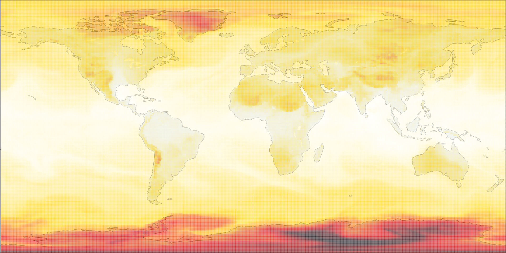

# Generalised Implicit Neural Representations


This repository contains the supplementary material for 

**"Generalised Implicit Neural Representations"**  
_Daniele Grattarola, Pierre Vandergheynst_  
Neural Information Processing Systems (NeurIPS 2022)  
[Paper](https://arxiv.org/abs/2205.15674) | [Interactive README](https://danielegrattarola.github.io/GINR/)

Bibtex: 
```
@article{grattarola2022generalised,
  title={Generalised implicit neural representations},
  author={Grattarola, Daniele and Vandergheynst, Pierre},
  journal={Advances in Neural Information Processing Systems},
  year={2022}
}
```

This repository contains all necessary code and commands to reproduce our results, as well as high-resolution and animated versions of the figures in the paper.

# Visualizations

## Learning generalized INRs

|  |  |
|-----------------------------------|-------------------------------------|

These links load interactive visualizations of the Stanford bunny mesh and the 1AA7 protein surface used in the first experiment. The signals shown on the surfaces are INR predictions:

- [Bunny (7.7 MB)](assets/bunny.html)
- [Protein (4.8 MB)](assets/protein_1AA7_A.html)

## Super-resolution

These links load interactive visualizations of the Stanford bunny mesh, both the original resolution and the super-resolved version. Note that we show the signal as a scatter plot on the surface to highlight the increased resolution. Both signals are INR predictions.

We also show a surface plot of the squared error between the corresponding training and test nodes.

- [Original signal (9.7MB)](assets/sr_bunny_original.html)
- [Super-resolved signal (28.4MB)](assets/sr_bunny_superresolved.html)
- [Squared error between corresponding nodes (7.8MB)](assets/sr_bunny_error.html)

## Reaction-diffusion

This animation shows the signal predicted by a conditional INR for the Gray-Scott reaction-diffusion model. The INR was trained on samples at `t = 0 mod 10`, while this animation shows the predictions at `t = 0 mod 5`.

The sudden color changes are due to outliers that change the automatic color scale. 

- [Reaction-diffusion animation](assets/bunny_reaction_diffusion_pred.mp4)

## Weather

For the meteorological signals on the spherical surface of the Earth, we show: 

- A side-by-side comparison of the signal predicted by the INR at time `t=4.5h` at the original resolution and on the high-resolution sphere
- A video of the training data (65160 nodes, 24 FPS)
- A video of the high-resolution signal interpolated over time (258480 nodes, 48 FPS)

We show every visualization for each of the three types of signal: wind, temperature, and clouds.

### Wind

- Side-by-side comparison of the prediction at original and high resolution. Click on "view" to see the full image.

| Original, 65160 nodes [(view)](assets/gustsfc_pred_4.50.jpg) | Super-resolved, 258480 nodes [(view)](assets/gustsfc_pred_sr_4.50.jpg) |
|------------------------|-------------------------------|
|||

- [Training signal - Video at 24 FPS](assets/gustsfc_training.mp4)
- [Super-resolved signal with time interpolation - Video at 48 FPS](assets/gustsfc_pred_sr.mp4)

### Temperature

- Side-by-side comparison of the prediction at original and high resolution. Click on "view" to see the full image.

| Original, 65160 nodes [(view)](assets/dpt2m_pred_4.50.jpg) | Super-resolved, 258480 nodes [(view)](assets/dpt2m_pred_sr_4.50.jpg") |
|------------------------|-------------------------------|
|||

- [Training signal - Video at 24 FPS](assets/dpt2m_training.mp4)
- [Super-resolved signal with time interpolation - Video at 48 FPS](assets/dpt2m_pred_sr.mp4)

### Clouds

- Side-by-side comparison of the prediction at original and high resolution. Click on "view" to see the full image.

| Original, 65160 nodes [(view)](assets/tcdcclm_pred_4.50.jpg) | Super-resolved, 258480 nodes [(view)](assets/tcdcclm_pred_sr_4.50.jpg) |
|------------------------|-------------------------------|
|||

- [Training signal - Video at 24 FPS](assets/tcdcclm_training.mp4)
- [Super-resolved signal with time interpolation - Video at 48 FPS](assets/tcdcclm_pred_sr.mp4)

# Reproducing experiments

## Setup

The code is based on Python 3.9 and should run on Unix-like operating systems (MacOS, Linux).

All necessary dependencies are listed in `requirements.txt`. You can install them with:

```shell
pip install -r requirements.txt
```

Additionally, PyMesh library has to be built from source. You can install it with:
```shell
sudo apt-get install libmpfr-dev libgmp-dev libboost-all-dev
bash install_pymesh.sh <PATH_TO_PYMESH_INSTALL_DIR>
```

The training and evaluation scripts use Pytorch Lightning and Weights & Biases.
You should make sure that W&B is properly set up by following this [quickstart tutorial](https://docs.wandb.ai/quickstart).

## Data

### External data sources

To reproduce all experiments in the paper, you need to download data from some external sources: 

- The Stanford bunny is available [here](https://graphics.stanford.edu/data/3Dscanrep/). Download and unpack the tarball into the `data_generation` directory.
- The US election dataset is available [here](https://www.cs.cornell.edu/~arb/data/US-county-fb//). Download and unpack the zip into the `data_generation` directory. 
- We generated the protein dataset using the code from [Gainza et al.](https://github.com/LPDI-EPFL/masif). The full list of PDB identifiers that we used is available in `data_generation/proteins_src.txt`. 

The script to generate the weather dataset uses the `getgfs` package to automatically download the data from GFS ([link](https://github.com/jagoosw/getgfs)). 
The library only allows downloading data from the most recent week. The scripts in `data_generation` will attempt to download 24 hours of data from the most recent day (i.e., yesterday).

To get the same data that we used (May 9, 2022, 00.00-23.59), you have to pull it manually from the [historical server](https://www.ncei.noaa.gov/thredds/catalog/model-gfs-004-files-old/catalog.html). Have look at [this repository](https://github.com/albertotb/get-gfs) that shows how to do it in Python. 
Note that the historical server only has data at 3-hour increments (the normal server has 1-hour increments).  


### Data pre-processing

Once you've downloaded the external data, you can run the commands in `commands_data.sh` to pre-process the data into a format that can be used by the rest of the code. 

All necessary scripts for creating the training data are in the `data_generation` directory. 

Note that the scripts must be run from the parent folder, not the directory itself, e.g.:

```shell
python data_generation/bunny.py
```

Some of the commands can take a while. We suggest checking that every command was executed successfully (i.e., no Python errors were displayed).

### Data availability

Feel free to reach out to us if you want access to the exact pre-processed files that we used for the paper. 

### Creating a dataset

To create a dataset, you must create a folder with the following structure:

```
dataset_name
└── npz_files
    ├── data_1.npz  # the name is not important
    ├── ...
    └── data_n.npz
```

Each NPZ file represents one graph and should contain the following key-value pairs: 

- `fourier`: Numpy array of shape `(n_nodes, n_fourier)` containing the spectral embeddings
- `points`: Numpy array of shape `(n_nodes, n_coords)` containing node coordinates used for plotting the graph
- `target`: Numpy array of shape `(n_nodes, n_targets)` containing the target signal

Optionally, you can add an extra keyword for creating a time-conditioned dataset like we did in the reaction-diffusion and weather experiments:

- `time`: scalar, representing the time instant associated with the graph signal (or whatever else, as long as it's a scalar). 

If you have a dataset composed of a single graph with multiple signals, instead of replicating the spectral embeddings for all signals you can just put a single NPY file called `fourier.npy` (**not NPZ**) in the topmost directory. Same thing for the `points`.

The directory structure, in that case, looks like this:
```
dataset_name
├── npz_files
│   ├── data_1.npz
│   ├── ...
│   └── data_n.npz
├── fourier.npy
└── points.npy
```

## Training

The main training script is called `train_ginr.py`.
You can run the following command to get a list of possible options:

```shell
python train_ginr.py --help
```

There is also a script called `train_sbm.py` to run the SBM experiment. 

The exact commands that we used for all experiments are listed in `commands_training.sh`.


## Evaluation

The evaluation scripts have filenames that start with `eval_` and can be used to generate the plots and run some analyses. 

All the evaluation script require a Pytorch Lightning checkpoint file as input (which will be automatically saved by the training script).

See the docstring of each file for usage instructions. 
